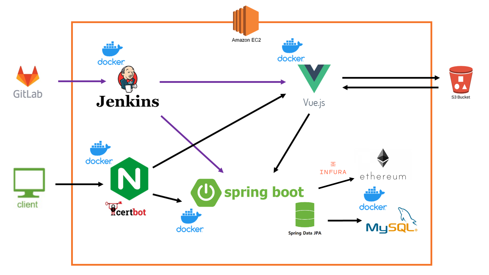
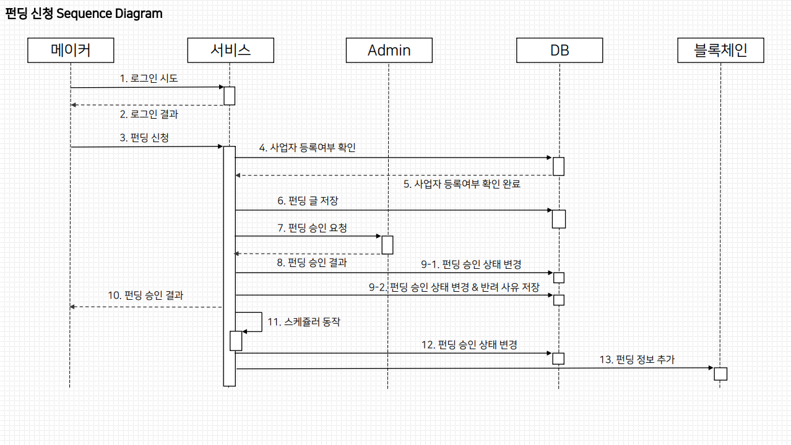
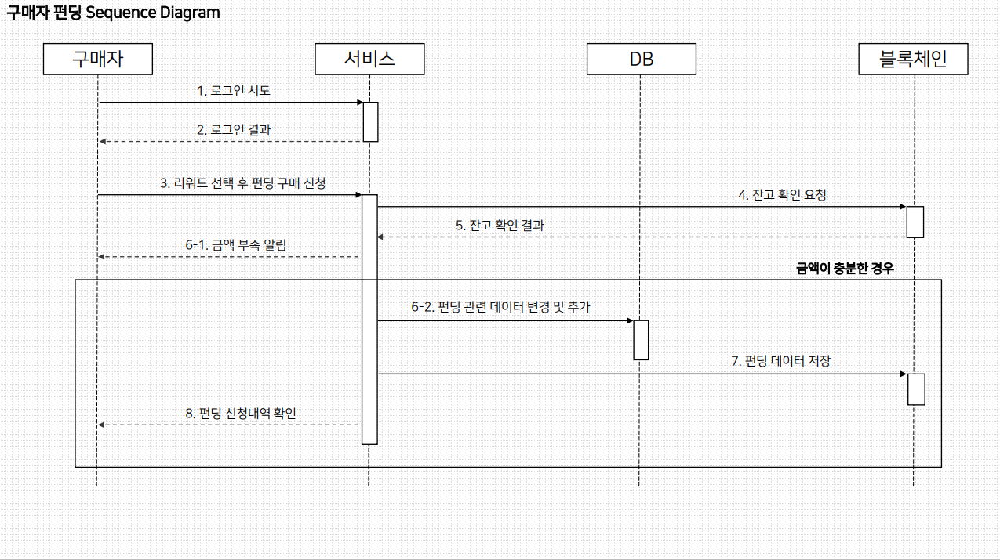
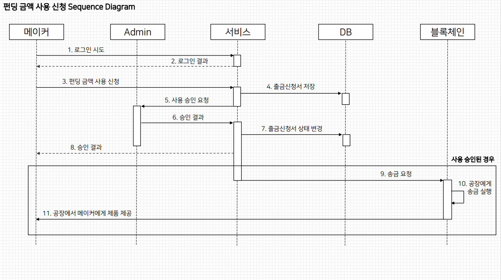
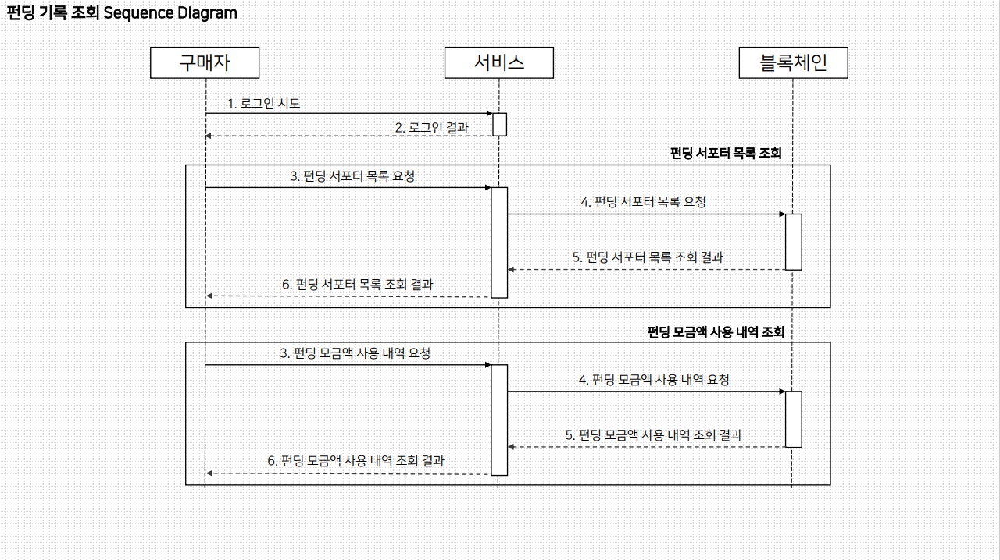
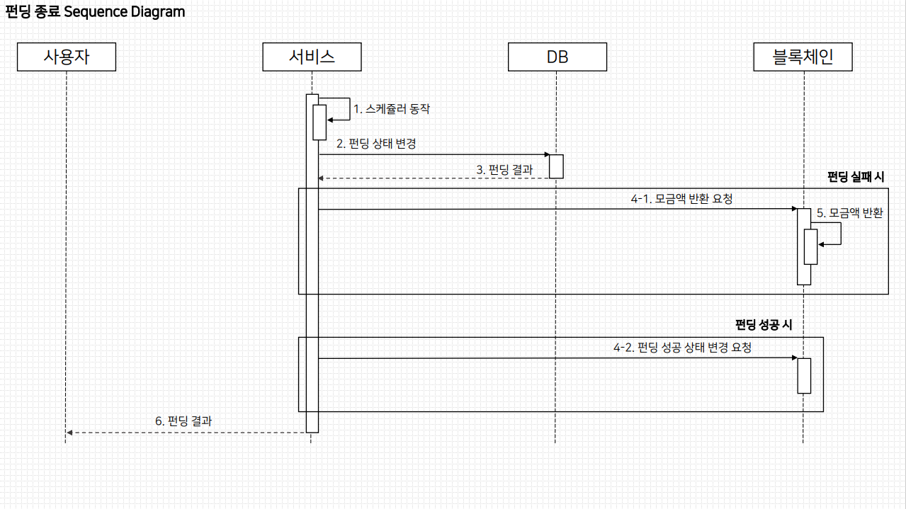
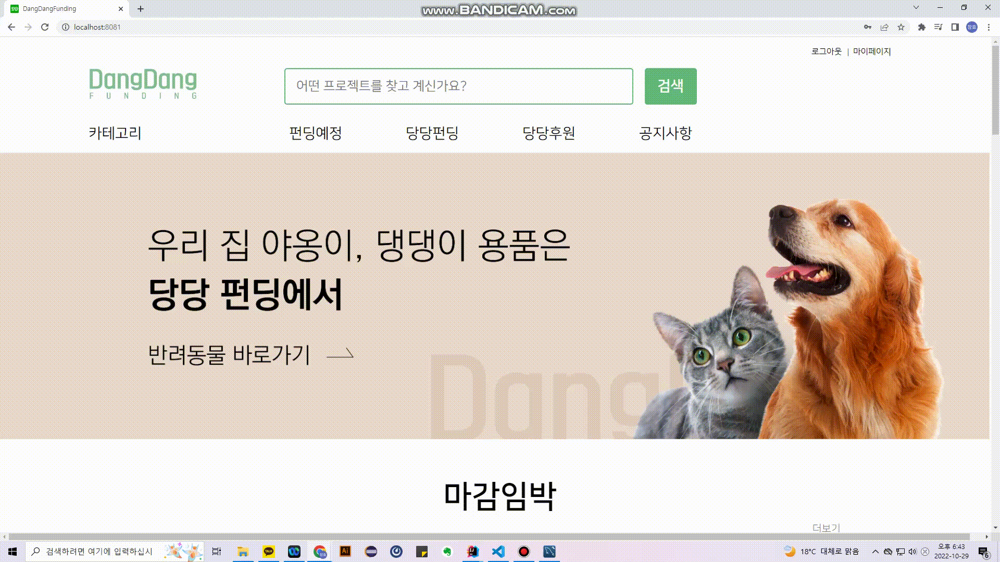

# 당당펀딩 - 블록체인을 활용한 투명한 크라우드펀딩

## 📅 프로젝트 진행 기간

- 2022.08.29 ~ 2022.10.07 (40일간 진행)
- SSAFY 7기 2학기 특화프로젝트 A306 - DangDangFunding

## ✅소개

- 블록 체인 기술을 활용한 투명한 크라우드 펀딩 `당당펀딩`

## ✅기획의도

- 크라우드펀딩 시 총 모인 모금액은 알 수 있지만 그 모금액이 어디서 어떻게 쓰이는 지 정확한 정보를 알기에 어려움이 있습니다.
    
    저희는 이를 해결하고자 블록체인 기술을 통해 모두가 투명하게 거래 내역을 확인 할 수 있게 하여 신뢰성, 투명성을 높인 크라우드펀딩을 기획했습니다.
    

## ✅주요 기능

- 펀딩 상품 판매 (크라우드 펀딩 진행)
    - 펀딩 신청서 작성 후 별도의 승인절차 이후 작성한 펀딩 시작일에 맞춰 펀딩이 열리게 됩니다.
    - 펀딩 신청 시 작성한 리워드를 기준으로 펀딩 모금이 진행됩니다.
        - 단, 펀딩 신청 시 작성한 마감일까지 펀딩 목표 금액에 도달해야 펀딩이 성공적으로 종료되고 본격적인 판매를 시작할 수 있습니다.
        - 금액 미달성 시 펀딩은 실패로 종료되며 모금액은 구매자의 계좌로 돌아가게 됩니다.
- 펀딩 상품 구매
    - 펀딩에 상품과 수량을 선택 후 계산하면 펀딩이 완료됩니다.
    - 모금이 완료되면 펀딩이 시작되고 판매자가 펀딩 상품 제작에 사용한 금액을 확인 가능합니다.
- 펀딩 관련 정보 조회
    - 블록체인에 기록된 펀딩 관련 정보를 조회할 수 있습니다.
        - 현재 사용자가 보고 있는 펀딩의 서포터(펀딩에 참여한 사람) 목록을 볼 수 있습니다.
        - 성공적으로 마감된 펀딩에 대해 메이커(제작자)의 펀딩 모금액의 사용처를 상세히 볼 수 있습니다.
    - 블록체인에 기록된 정보이기 때문에 변조가 불가능하며 누구나 투명하게 거래 정보를 확인할 수 있습니다.

## ✅프로젝트 아키텍처

---

## ✅기술 스택

### Backend

- Gradle 7.5
- Mysql 8.0.21
- AWS (Ubuntu 20.04)
- BlockChain (Private Network)
- Web3j 5.0.0

### Frontend

- HTML5, CSS, JS
- Nodejs 16.16.0
- Vue3 18.2.0

### Cooperation Tools

- Gitlab
- Jira
- Notion
- Figma

## ✅Sequence_Diagram

## ✅서비스 화면

### 홈 화면에서 다양한 펀딩을 확인하실 수 있습니다.

    

### 특정 펀딩을 누르면 상세정보를 확인하실 수 있습니다.

    

### 서포터 탭에서는 어떤 사람이 펀딩에 참여했는지 확인하실 수 있습니다.

    

### 펀딩참여를 누르면 상품을 선택하고 펀딩에 참여하실 수 있습니다.

    

### 마이페이지에서 본인이 서포터로 참여한 펀딩에 대한 정보를 확인하실 수 있습니다.

    

### 마이페이지에서 본인이 메이커로 참여한 펀딩에 대한 정보를 확인하실 수 있습니다. 
- 모금이 완료된 펀딩은 통장내역이 표시됩니다.

    
